# Procedural City Generator in Unity

###### Implementation and discussion of Parish & Müller's approaches to procedural modeling of cities and buildings.

Vincenzo Lombardo - 978383,

August 30, 2022

------

### Abstract

This paper will illustrate in general the approach used by Parish & Müller to procedural modeling of cities and building with their so-called Extended L-Systems, and an implementation in Unity that also introduces the procedural generation of those input data required by the original algorithm. 

The aim of this paper is to briefly explain the concept of the algorithm, then illustrate and discuss the implementation provided with the prospects for improvement offered by this approach. 

------

### Introduction

Procedural content generation was, and still is, an innovative and effective approach to creating unique report-assets and graphic elements without the need to manually define them. The main idea was to create content using rules based on mathematical patterns or generic descriptions of how to combine pre-generated resources, and execute them with a touch of randomness that leads to unpredictable and unique results. 

On the other hand, procedural content generation needs computational power to handle complex models that can create more realistic outputs. This is the reason why modeling and visualizing systems that offer the possibility to create large content is one of the most discussed reasearch topic for computer graphics. Thanks to technological progress and research, we can now rely on much more power and optimizations that let us be able to push the limits of content generation. 

One of the most common approaches for procedural content generation is the Lyndenmayer system, a parallel rewriting system and a type of formal grammar used to define production rules. However, it suffers from some limitations that make it impossible to handle large content generation efficiently due to the absence of additional parameters and context awareness. Parish and Müller's research presented a method for extending the classical L-system approach to a system capable of these properties, which made it possible to create an efficient algorithm for generating large content, such as cities and buildings.

This paper will discuss about the implementation in Unity of an Extended L-system for the generation of city's road map and an enhanced system for detalied building modeling (published by Müller), combined with a system based on Perlin noise function for the terrain generation and a consistent and pseudo-realistic population density map, which are the input data for the city generator. The entire system is also *seed-based*, allowing to replay a specific generation through its seed.

------

### Extended L-system

The goal of Parish and Müller's research was to define a system that could take the environment into account during generation through queries, giving the ability to analyze the current state and collect data to use as additional parameters, creating more consistent and realistic outputs. 

Classical L-systems are defined by a set of production rules for parallel string rewriting. Each string represents a module interpreted as commands, and their parameters are hard-coded into these modules. To create a complex system a lot of parameters and conditions are required, causing an exponential growth of production rules. Also extensibility suffers due to the several rules needed to implement a new constraint.  

In contrast, Extended L-systems do not define production rules for any case, but split the generation and create from the core L-system only a generic template called the *ideal successor*. Its parameters are then modified by a hierarchy of external functions divided by higher-level tasks and environmental constraints, defined as *GlobalGoals* and *LocalConstraints*, respectively. 

For each production, the L-system creates the ideal successor; then the GlobalGoals function assigns parameters based on the high-level rules, and the LocalConstraints function completes or aborts the generation by checking and adjusting parameters based on environmental constraints. 

In the case of a city generator, this context awareness is very useful for assessing, during the generation of a new road, whether other previously created streets intersect with it or offer the possibility of merging with roads or intersections, creating a more complex road map.  

<figure align = "center">
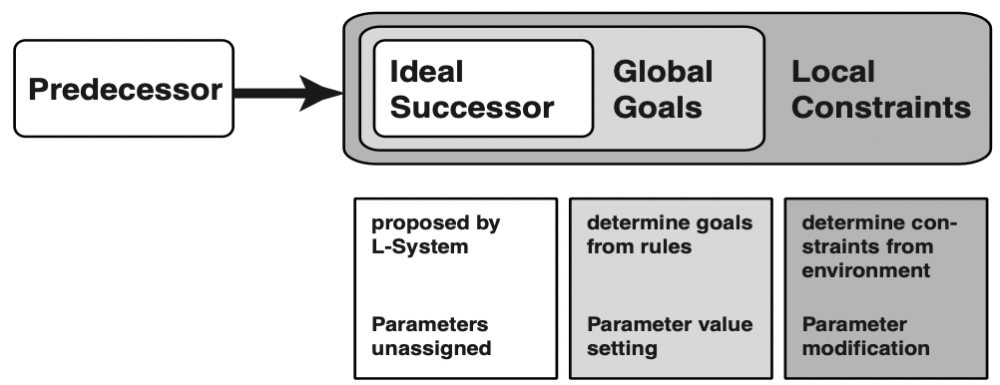
<figcaption><b>Fig.1 - Production of element by an Extended L-system</b></figcaption>
</figure>

#### Implementation

In the Unity implementation presented, instead of defining an L-system that handles strings, the core system is implemented as a queue of modules to be evaluated because of their variable parameters that would be difficult to handle as strings. 

##### Road map generator

Modules are defined as objects of type `RoadModule` or `BranchModule`, and both implement the `IRMModule` interface to be managed together by the evaluation queue. Depending on which module the system is evaluating, the operations to be performed are computed by a handling function, one for both modules. 

In the case of RoadModules, the function to be called is decided by a state parameter: when a new road is successfully generated, its state is set to ` SUCCEED`; then the GlobalGoals function uses the road data to define the high-level parameters of a new road, with its module state set to ` UNASSIGNED`, and a pair of road branches alongside it; finally, the LocalConstraints function attempts to assign the final parameters and generate the road in the environment; if the latter operation is successful, the state of the road module is updated to ` SUCCEED` or ` MERGED` (if the new road has been merged with a neighboring road or intersection), otherwise if no valid parameters are found its state is set to ` FAILED` and the module is destroyed. 

##### Building generator

In this case, the core system needs to handle only one type of module, namely the ` Shape` class. A shape represents an intermediate part of the building waiting to be evaluated to generate other shapes that define its higher-level details. 

Once a shape has been evaluated, it is set as inactive and leaves the representation of its part of the building to the new shapes generated by it. The generation of a building is completed when no active shapes remain.

Unlike the road map generator, this system is not an Extended L-system as defined above, but still contains elements of context awareness: some building model production rules may introduce functions to test or manipulate the environment in order to set module parameters according to the current context.

------

### CityEngine

This is the name of the system created by Parish and Müller that implements an Extended L-system for the generation of a city's road map and unique buildings. The main focus of their project was on the first part: the creation of a consistent and realistic road map with high extendability and control on the generation. 

To achieve their goal, they designed an algorithm for global goals based on population density: as a basic rule, at least a city's highways should follow and cover the highly populated areas to give residents close access to the next highway. To execute this approach, when defining a new road and assigning global goal parameters, its direction is adjusted to face the highly populated area within a certain angle of rotation by scanning the population density map with a predetermined number of rays: the direction chosen is that of the ray with the highest weight, based on the density values scaled by the inverse distance from the origin of the ray. The weight calculation is given precisely by the following formula:

$$
w(v) = \sum_{i = 0}^{l} \left \\{ M(P) \cdot \left(1 - \frac i l \right) \ | \ P = A + v \cdot i \right \\}
$$

where $l$ is the road's length, $M$ is the population density map, $P$ is a point on the map, $A$ is the road's starting point and $v$ is the ray's direction.

<figure align = "center">
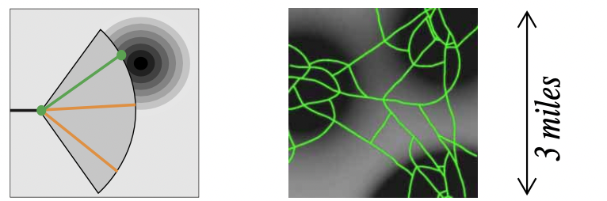
<figcaption><b>Fig.2 - High populated area strategy</b></figcaption>
</figure>

A unique feature of CityEngine is the ability to alter the generation of the system simply by changing the global goal rule to achieve another behavior. Because of this feature, to increase the realism of the generation or to achieve a specific pattern, creating a more complex global goals rule allows for a completely different result without changing anything else in the system. A completely different behavior can be achieved simply by changing the angle of rotation and the number of rays from the previous rule.

The LocalConstraints function, on the other hand, can be adapted without modification, regardless of the GlobalGoals rule. Its purpose is to check whether the directions chosen by the GlobalGoals function are valid or not. This function has many roles in the generation process:

* Check if the direction of the road and its end point calculated accordingly do not create a road over water. If this happens, an attempt is made to correct the road with:

  1. Pruning the length of the segment down to a given factor
  2. Rotating the segment within a maximum angle

  If after these operations the road is still in an illegal location, its creation is aborted and the module status is set to `FAILED`, causing it to be destroyed. 

* Searches for the intersection with another road and applies a merge between them; then confirm the creation and sets the state of the module to `MERGED`, so that the generation of new roads from its end is stopped (because it might cause overlapping).

* Scans the surroundings of the end of the road within a given radius to find other roads and intersections to merge with in order to increase loops in the road map, a recurring feature in realistic ones. Depending on the nearest element, different strategies are applied:

  * When the nearest element is another road, it extends the current road and forms a new intersection (but prefers the nearest intersection if its distance is less than the found intersection)
  * When the nearest element is a crossroad, extend the road and reach it.

<figure align = "center">
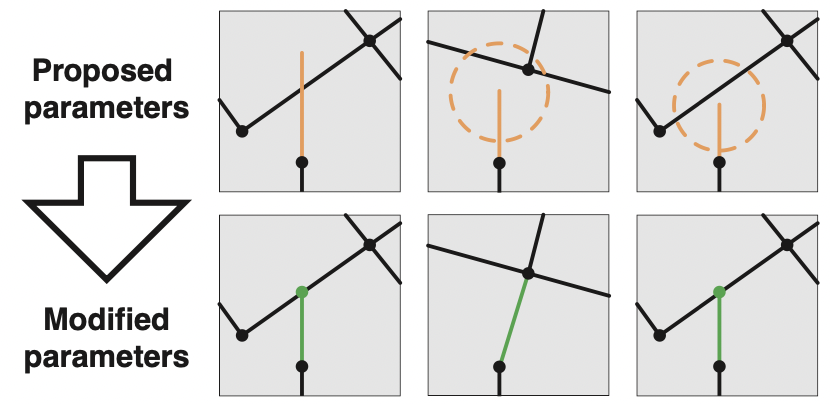
<figcaption><b>Fig.3 - LocalConstraints merging strategies</b></figcaption>
</figure>

#### Implementation

Both GlobalGoals and LocalConstraints functions are called by the road module manager, based on the module's state value, as described above. 

Global goals rules are defined as classes that implement the ` IRoadMapRule` interface. During generation, the selected rule object is created at the beginning and its type is chosen by checking the value of the ` rule` parameter, which allows a rule to be chosen directly from the Unity inspector as a menu bar thanks to ` enum RoadMapRules` that lists all currently supported rules. 

Each global goal rule must define, as required by the interface, two functions: `GenerateHighway` and `GenerateByway`. They are called by the GlobalGoals function to change the direction of new roads according to the pattern that the rule implements. 

The basic rule described above, based on the population density map, is implemented as the `BasicRule` class. It generates the parameters for highways and byways with the most populated area strategy and returns the best direction for new roads within a maximum angle defined in the ` scanAngle` parameter, while the number of rays to be used is decided by the ` scanRays` parameter. 

To give an example of the extensibility offered by the CityEngine system, another rule called `NewYorkRule` is available in the presented implementation. This rule is a constrained version of the previous BasicRule: considering that the two side branches created by the GlobalGoals function have as their initial direction the 90-degree and -90-degree rotated direction of the parent street, the NewYorkRule attempts to simulate in an extreme context (for visualization purposes) a street map model similar to that of Manhattan, forcing the proposed direction to remain unchanged to create intersections with right angles. 

<figure align = "center">
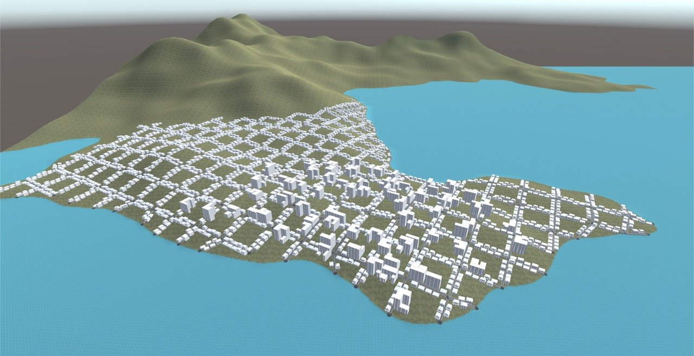
<figcaption><b>Fig.4 - Example of city with NewYorkRule</b></figcaption>
</figure>

To implement the check by the LocalConstraints function on the neighborhood of a new road, a spatial data structure such as *Quadtree* was introduced to easily obtain the elements within the given radius and avoid checking all previously generated elements (which in a large generation such as this one, could lead to a huge computational cost).

------

### Modeling of buildings

Once the street map is generated, the system must create the buildings in the map. In this section we will discuss the original CityEngine approach in general, and then explain the improvements made by Müller's subsequent research into detailed building modeling and its implementation for this project. 

#### CityEngine's modeling

This step is preceded by calculating the subdivisions for each block obtained from the road intersections. This is achieved by a simple recursive algorithm that divides the longest edges that are approximately parallel until the subdivided lots are less than a threshold area. Then concave lots are eliminated because they are difficult to handle. 

Once the lots where buildings are to be placed are obtained, they are generated using a stochastic and parametric L system based on transformation modules that manipulate an arbitrary surface. The modules are divided into four types: extrusion, branching, termination and geometric patterns used to create roofs, antennas and other small details. With these operations, a building is created from a bounding box with the assigned lot size and height given according to the building type. 

In the version of CityEngine described in his first article, Parish and Müller defined production rules for the system that can generate three types of buildings: skyscrapers, commercial buildings and residential houses.  

<figure align = "center">
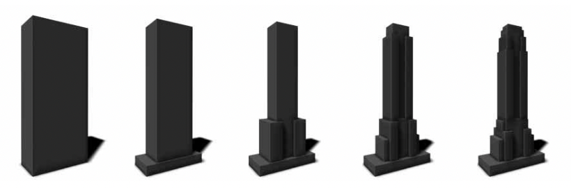
<figcaption><b>Fig.5 - Example of a skyscraper generated with CityEngine at different steps</b></figcaption>
</figure>

#### Enhanced modeling

To overcome the limitations of the previous approach, years later Müller published a second paper entitled "Procedural Modeling of Building" in which he presented *CGA Shape*, a new shape grammar for procedural modeling of architecture in computer graphics, capable of producing building shells with high visual quality and geometric detail. 

The concept of this new approach is to introduce a grammar of shapes with production rules that iteratively evolve a design by creating more and more details. In essence, it is a natural evolution of the previous approach, extended to support complex grammars and specific operations to define finer details than before. 

The basic logic of set grammars and shape splitting rules had been introduced earlier by Wonka, but Müller gave a concrete definition to these operations and created a functional and effective implementation. Instead of a classical L-system, which is useful for increasing generation tasks, the approach used for CGA Shape is a sequential application of rules that allows characterization of structure, such as the spatial distribution of features and components, leading to a Chomsky-like grammar.

##### Shape grammar

The grammar used for this system works with a configuration of shapes, defined by:

* A symbol, that identifies the shape
* A *scope*, geometric and numeric attributes describing its location and size
* A vector of numerical values describing the rotation of the shape by Euler angles.

<figure align = "center">
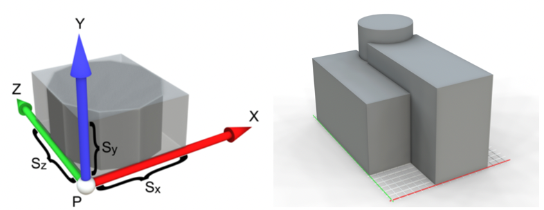
<figcaption><b>Fig.6 - Left: scope of a shape. Right: example of building model composed by three shapes.</b></figcaption>
</figure>

The production process consists of evaluating the currently active shapes. Starting with the axiom shape, for each active shape a production rule is chosen that matches its symbol and satisfies the required conditions, successors are calculated as new active shapes, the current shape is marked as inactive, and the process is repeated until there are no more non-terminal active shapes.

A production rule is defined by a unique identifier $id$, aka its name, the predecessor symbol, a set of logical conditions that the predecessor must satisfy, and the shape of the successor followed by its probability of being chosen. They are defined with the following notation:

$$
id :\  \quad \text{predecessor} : \text{condition} \leadsto \text{successor} : \text{probability}
$$

Similar to L-systems, CGA Shape introduces general rules for modifying shapes. There are two main categories, used to modify a shape or to divide it into other shapes with specific patterns: 

* Scope rules are used to change the scope of a shape through translation, scaling or rotation; rules to *push* and *pop* scopes are also in this category.
* Split rules are used to divide the scope of a shape and assign parts to its successors: 
  * *Subdivide* allows you to divide the current scope along one or more axes and define the exact size of the division for each successor.
  * *Repeat* allows the current scope along one or more axes to be partitioned into tiles and each tile to be assigned a successor copy.
  * *Component* allows to split into shapes of lesser dimensions; e.g. create a bidimensional shape for each face of the original tree-dimensional shape

The final model of a building consists of minor models for each terminal shape of the grammar, which create an instance of a geometric primitive (such as cube, square, cylinder, ...) and set it with the attributes of their scope. 

To generalize rules and avoid constant numbers for each case, rule attributes can be defined as *relative*, so that they scale with the values of the current scope or fit with the given constant attributes. In the second case, a relative value is calculated from the *absolutes* (constants) using the following formula:

$$
\frac {r \cdot (S - \sum abs_i)}{\sum r_i}
$$

where $r$ are the relative values, $S$ is a value from scope, and $abs$ are the absolute values. 

To introduce context-awareness in CGA Shape, the main feature discussed in this paper, the authors describe two queries that allow the creation of rule conditions based on the state of the environment: *Occlusion* and *Visible*. 

An Occlusion query checks the intersections between the target shape and all others, specifying whether the intersection found is partial or full (one is entirely contained in the other). The shapes to be tested can be filtered by keyword or by shape symbol. The keywords presented for Occlusion are: 

* ` noparent`: exclude all predecessors of the target
* ` all`: consider all shapes generated from the beginning
* ` active`: considers only currently active shapes

The Visible query is used to check whether a shape is located in the front facade of the building, which is useful for discriminating rules reserved for details of this facade, such as the building entrance.

#### Implementation

Analysing the features offered by CGA Shape, compared to the original approach in CityEngine, resulted in shifting the attention to it. Because of its generation based on Chomsky-like grammars and Unity's *ScriptableObjects*, the idea to develop a system capable of supporting creation and editing of the building models rules directly from Unity editor was immediate, introducing then a whole new layer of user interaction by offering tools for the user to define its own grammars without the need of coding. 

##### CGA Shape

A building model's grammar is described by `RuleSet` class, which contains a reference to the axiom shape (`Shape` object) and a set of `RuleSetPriority`, each containing the actual rules represented by `Rule` class. This `RuleSetPriority`  intermediate class allows to group rules by priority, to create both an execution order and a hierarchy based on the level of details they create.

The Rule class is implemented consistenty to its formal definition discussed above, containing a symbol, a set of `RuleCondition` objects describing its conditions, and a set of `RuleAction` describing the events to create the successors.

A RuleCondition is a logical expression composed by an operator and two operands: a `RuleQuery` and a value. When evaluated, the query is computed and its result compared to the condition value according to the operator. The available queries are Occlusion and Visible. 

A RuleAction contains a probability and a set of `RuleActionItem`, objects that groups the `RuleFunction` objects, whose run the actual generation of the successors shapes. This intermediate class is introduced to both handle those actions that simply produce a new shape without additional operations, and to nest functions to create complex rules. Infact, a RuleFunction does not have a string symbol as output, but a reference to a RuleActionItem. When a Rule is executed, the action to *fire* is randomly chosen according to their probabilities.  

The RuleFunctions are the implementation of the previously discussed types of rule: the scope rules are represented by  `MoveScope` (translation) , `ScaleScope` (scaling) and `RotateScope` (rotation) classes, while the split rules by `Component` , `Repeat` and `Subdivide` classes. 

In addiction, two more RuleFunctions are introduces: `SpawnModel` and `Roof`, respectively used to create the final building part model by a terminal shape, and to handle the roof shape creation based on the chosen type and properties. 

Values are also represented through a family of classes with `Value` as the root, to introduce random values (`RandomValue`), operations (`OperationValue`) and numbers from the attributes of the current scope (`ScopeValue`) into the rules. All these elements contribute to the high flexibility of the rule creation system. In OperationValues, the two operands are actually Value objects, which allow operations to be nested. 

##### Examples of ruleset

In the implementation provided, only two sets of building model rules were defined: one for residential houses and another for office buildings. The second buildings are those located in the highly populated areas of the city. Both model grammars will be described following the notation introduced earlier. These grammars are obtained from a reinterpretation of the models described by Müller in his paper, adapted to the functions of this implementation.

Each grammar starts with a shape axiom that defines the width and depth of the building to be generated. The `ProceduralBuildingGenerator` class exposes the `GenerateBuilding` function to get a new building generated based on the provided 2D vector representing the lot size. As can be seen from the grammars below, each includes some stochastic rules to introduce uniqueness in the output models. 

Those values defined from constants follows the notation *example_constant*, to easily be distinguished from shapes symbols.

   ###### Office Building

It will generate buildings similar to those used for offices, with two possible sidewings. In the front facade of the ground floor there will be an entrance, while on the edges of the roof a small step will be generated. These models can of course be expanded to introduce new details into the buildings. 

This grammar is inspired by the model of the same name presented by Müller, with some simplifications due to the additional models needed, and some modifications to enhance uniqueness across generations, such as randomization of building height.

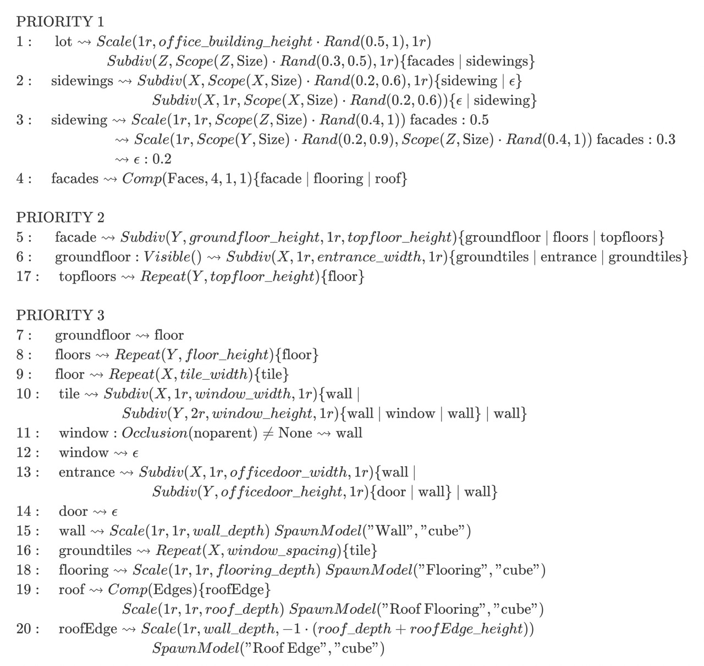

| 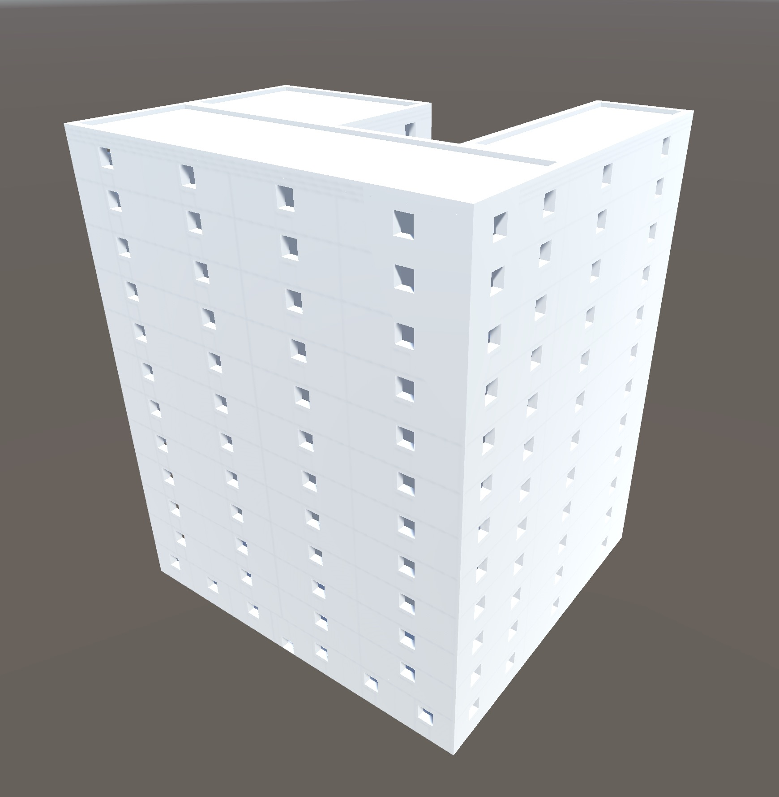 | 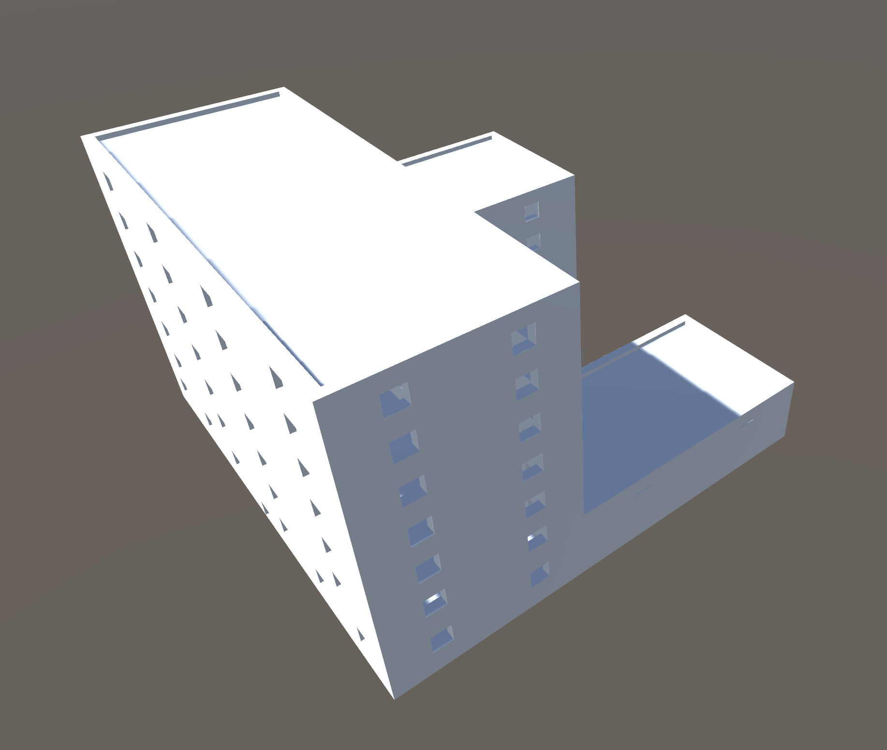 |
| :----------------------------------------------------------: | :----------------------------------------------------------: |

<figcaption><b>Fig.7 - Examples of office buildings</b></figcaption>

###### Simple Building

Generate residential houses in three possible combinations (each with the same probability to be chosen). 

This grammar is inspired by the model of the same name presented by Müller, with some simplifications due to the additional models required, and slight modifications to enhance the uniqueness between generations, in this case given by the three possible aspects. 

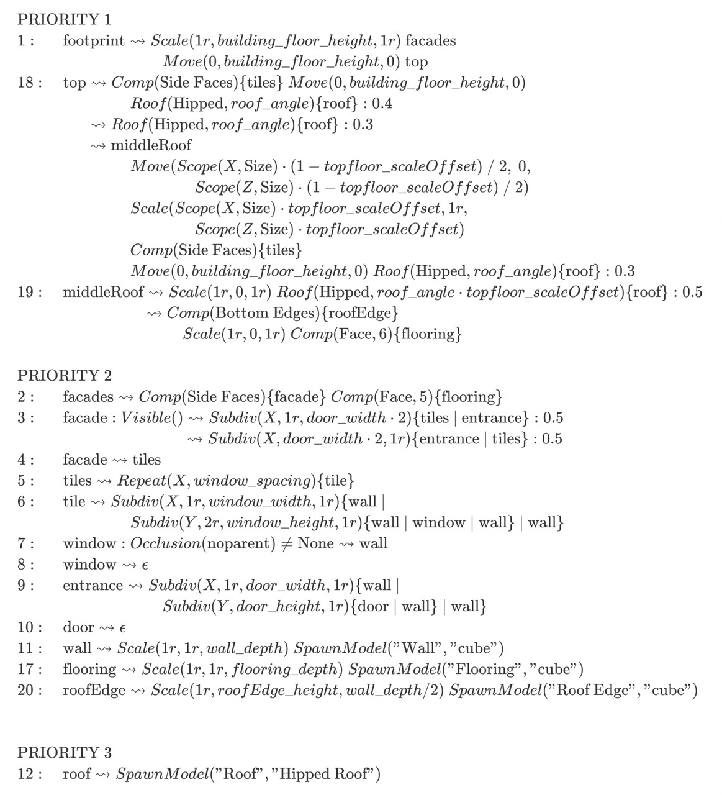

<figure align = "center">
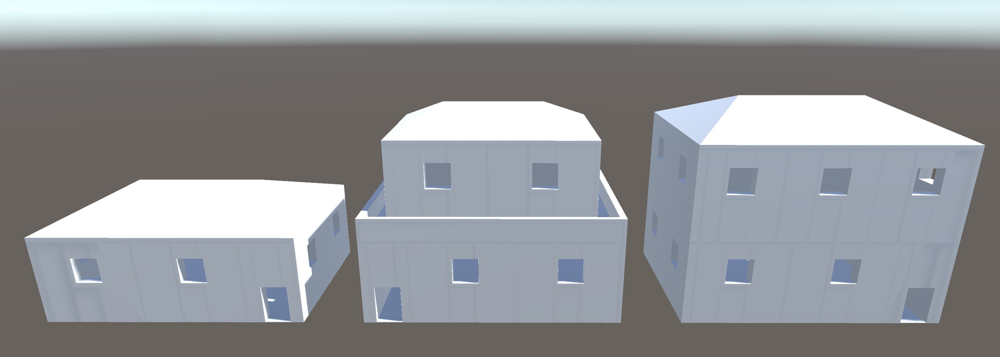
<figcaption><b>Fig.8 - Example of the three residential house models.</b></figcaption>
</figure>

##### Placing buildings

Once the road map is generated, the algorithm proceeds to evaluate each road and calculate building lots by computing the distance between buildings on both sides of the street. 

When calculating the position of a new building, the lot type and model to be placed are chosen based on a probability calculated from the population density at that position scaled by a random factor (to make taller buildings more sparse), then compared with the given thresholds. The system already allows more than two building models to be introduced and the probability threshold for each range to be freely decided.

After selecting the lot and model to be placed, the system checks for collisions between the roads and other buildings already placed through the `OverlapBox` function of Unity's *Physics* library: for each collision detected, it calculates the vector from the center of the lot and the point hit; if the angle between this vector and the vector perpendicular to the direction of the road is greater than a certain threshold (because the front sections of the road are also detected by OverlapBox, but they are actually placed at a correct distance by definition), the current location is considered illegal. In the case of an illegal position, the test is repeated with a smaller building model until a valid combination is found, otherwise the current lot is skipped and the next one is evaluated. 

To reduce the computational cost required for the generation of each building by CGA Shape, a *caching* system was introduced: when the generation of a new building is required, if the number of models already generated for the required ruleset is greater than the size of the cache (controlled by the `buildingCacheSize` parameter), one of these models is cloned using a random index; otherwise, a new model is generated by CGA Shape and saved in the cache. For each ruleset, the cache is able to store a number of models equal to its size.

------

### Input data

Another additional feature of my implementation is the procedural generation not only of the city, but also of the input data required by the original CityEngine algorithm, namely the terrain (represented in Unity by the height map) and the population density map, both generated through Perlin's noise function.

The implemented Perlin noise system combines the raw values from the `PerlinNoise` function of Unity's *Mathf* library with scaling factors, octaves (frequencies) and power calculations to adjust the values for the required task and reduce repetition cases. 

After randomly calculating the origin point in Perlin noise texture to to start reading from, generate a value for each cell of the matrix with the following formula: 

$$
\frac{\displaystyle \sum_{k = 0}^{ \text{nOctaves}} \frac {1}{2 ^k} \cdot PN(2^k x, 2^k y) }{\displaystyle\sum_{k =0}^{\text{nOctaves}} \frac {1}{2 ^k} }
$$

where $M$ is the matrix, $x$ and $y$ are the scaled coordinates from origin, $PN$ is the Perlin noise function, and $\text{nOctaves}$ is the number of octaves to evaluate.

#### Terrain generation

After populating the terrain heightmap matrix with Perlin noise function and the above formula, find the max and min values generated, and use them to calculate the height threshold for water. Then substract to the entire matrix its value in order to obtain the water at terrain height 0. 

The proposed parameters for Perlin noise and water threshold were calculated empirically and are capable of generating pseudo-realistic terrain similar to coasts and plains, but also capable of generating elevated terrain with sufficiently useful valleys for proper road map generation. 

| 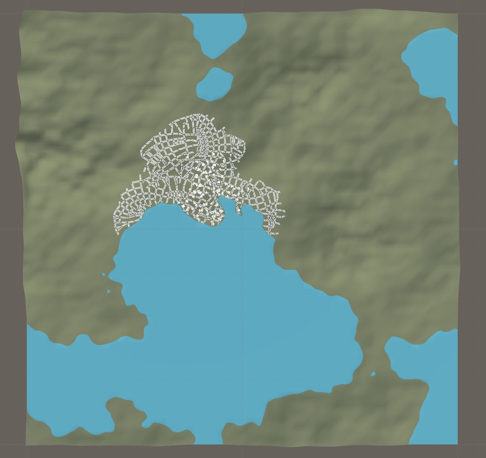 | 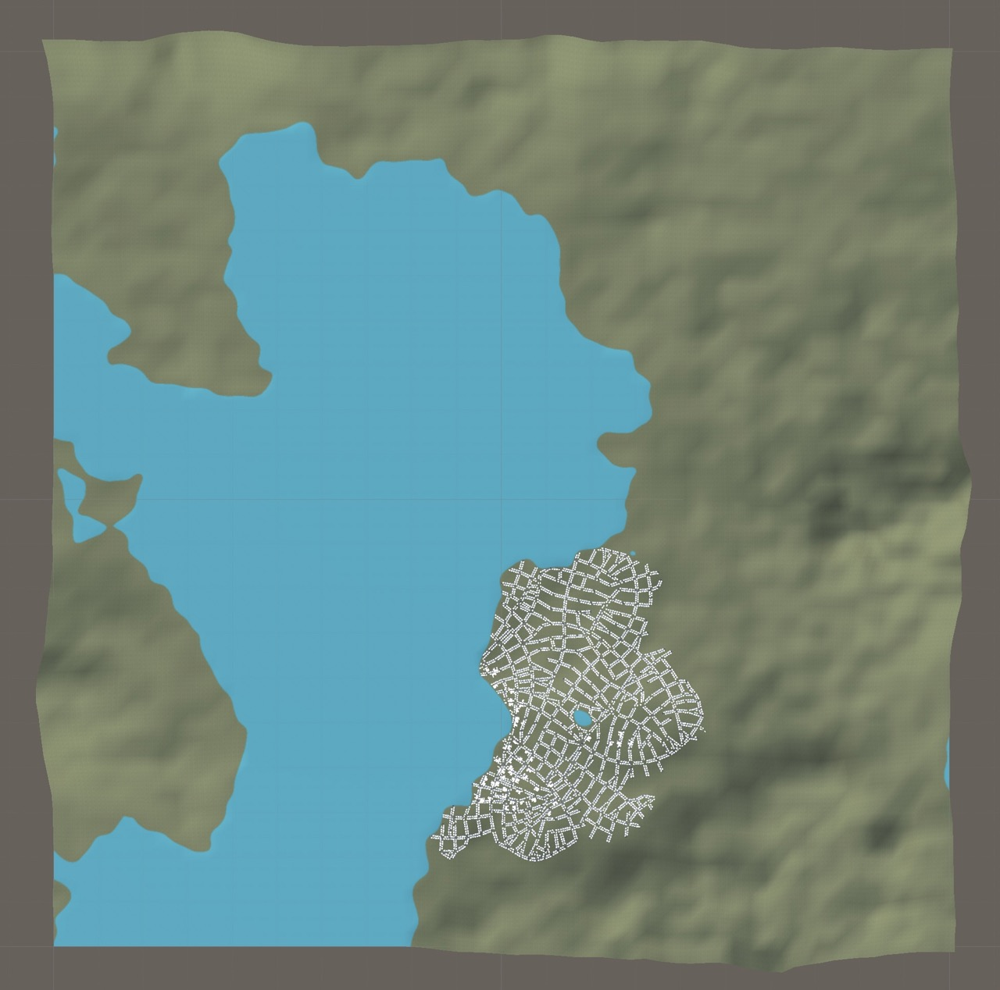 |
| -----------------------------------------------------------: | :----------------------------------------------------------- |

<figcaption><b>Fig.9 - Examples of generations</b></figcaption>

#### Population density generation

After generating the terrain, the system needs to generate the population density map of the city using both the Perlin noise function discussed earlier and a pair of distance functions that introduce a decay in the values that depends on the distance and height difference with the city center, resulting in more realistic outputs.

First, the algorithm decides the city center by randomly choosing locations within the map boundaries (controlled by the parameter ` mapBoundaryScale`, used to avoid city centers too close to the boundaries) until one meets the required conditions. Considering a neighborhood of values around it, a valid city center cannot: exceed a certain percentage of them on water (controlled by the parameter ` popDensityWaterThreshold`), exceed a certain threshold of height difference between it and its neighborhood, and of course be on water. Once the city centre is found, proceed with the generation of the population density map.

##### Distance functions

The first of the two distance functions is the so-called "*Cosine down to zero*." It decreases the values in a sinusoidal trend until the threshold is reached; then it always returns zero. This function introduces a decay in the Perlin noise values that depends on the distance between the current position and that of the city centre, and is very useful for two cases: zeroing out the values outside the city radius and smoothing out the others the farther they are from the centre.

The *Cosine down to zero* function is defined by the following formula:

$$
f(net) = \begin{cases}
0 & \text{if }\  net > 2\sigma \\
\frac{\cos\left( \frac \pi {2\sigma}  net \right) + 1}{2} & \text{otherwise}
\end{cases}
$$

where $net$ is the distance between the current position and the city centre, and $\sigma$ is half the city radius.

<figure align = "center">
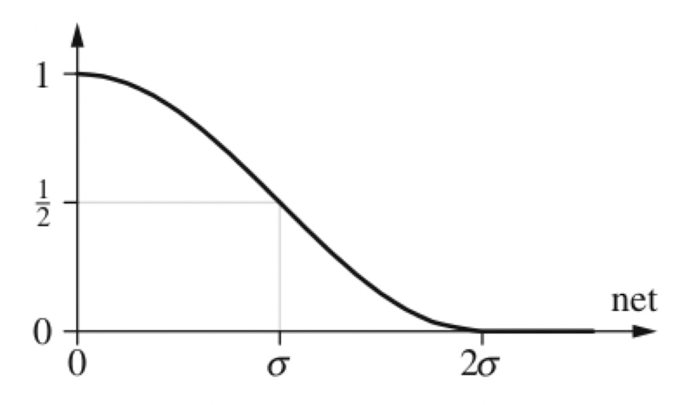
<figcaption><b>Fig.10 - Graph of "Cosine down to zero" function.</b></figcaption>
</figure>

The second distance function is a *Gaussian* function. It decreases values in a Gaussian bell-shaped trend until it reaches the threshold; then it slowly tends to zero. This function was introduced to decay the values of population density with a high elevation difference from the city center, and it is useful to lower the values of those areas that are on high terrain and to discourage the generation of roads and buildings in those areas. 

The *Gaussian* function is defined by the following formula:

$$
f(net) = e ^{- \frac {net^2}{2 \sigma ^2}}
$$

where $net$ is the distance between the current position and the city centre, and $\sigma$ is half the city radius.

<figure align = "center">
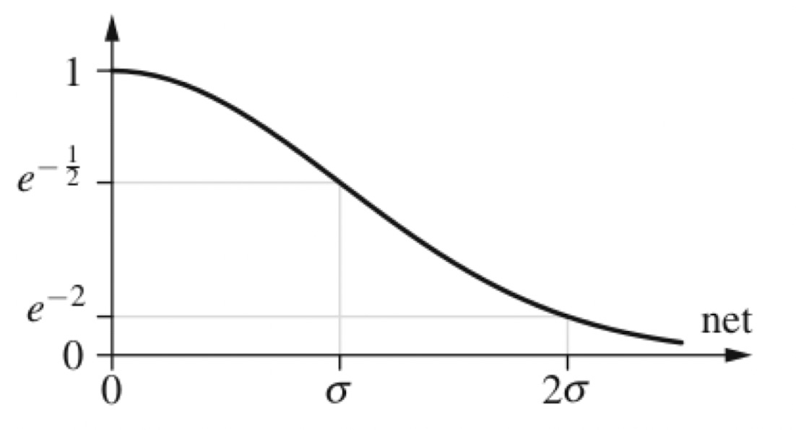
<figcaption><b>Fig.11 - Graph of Gaussian function.</b></figcaption>
</figure>

| 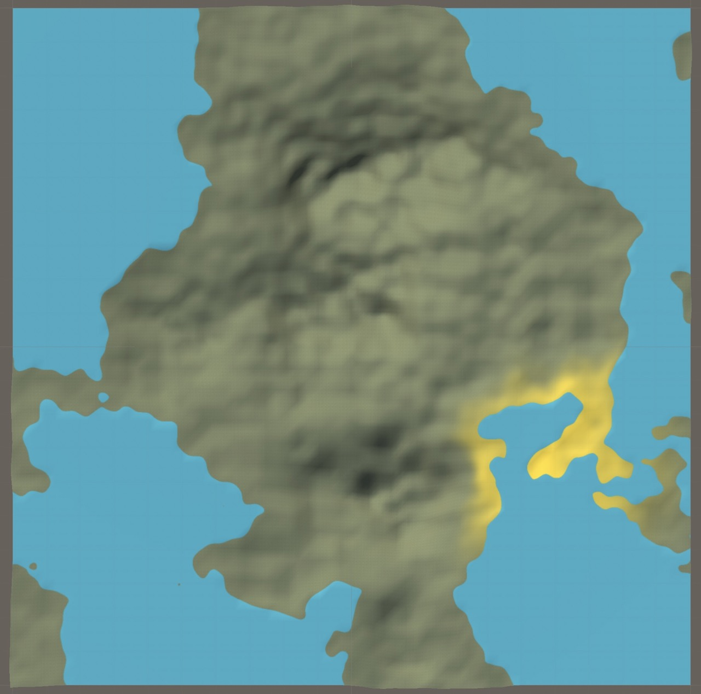 | 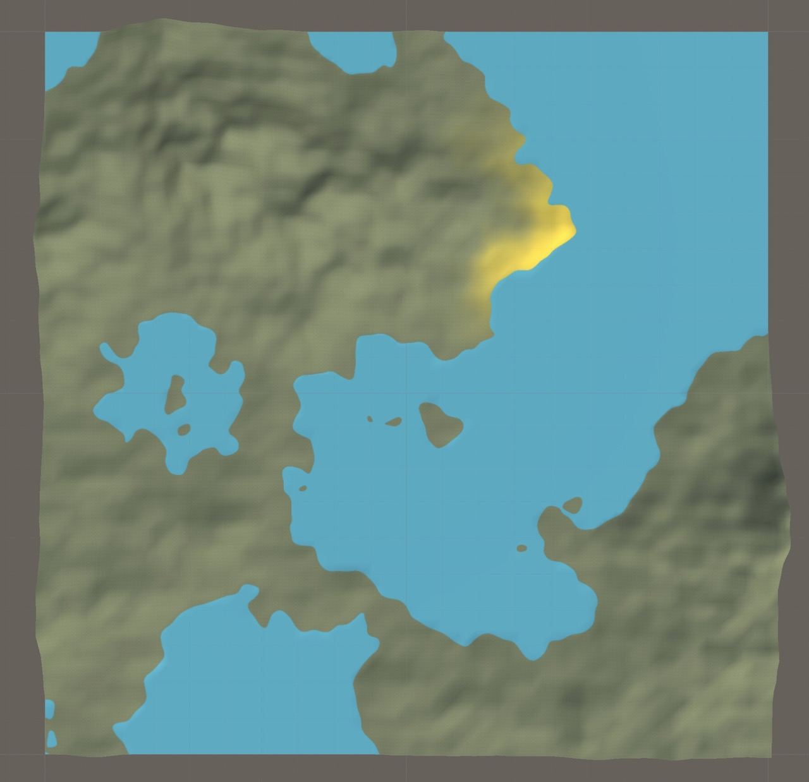 | 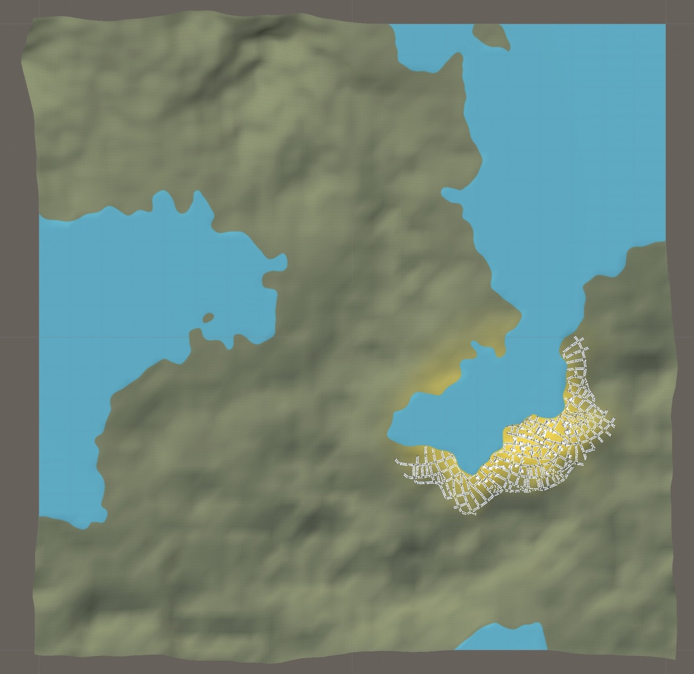 |
| -----------------------------------------------------------: | ------------------------------------------------------------ | ------------------------------------------------------------ |

<figcaption><b>Fig.12 - Left and center: generations with visible population density map. Right: generation with both population density map and city visibles. </b></figcaption>

------

### Conclusions

As shown, the approaches published by Parish and Müller in both papers are extremely interesting and rich in extension possibilities, starting with those discussed in mine. Even considering the current complexity of the generation and controls supported in the implementation presented, there are many improvements that can be achieved, such as more building models with finer details, the introduction of *snap lines* in the CGA Shape system for shape alignment, and, of course, further optimization to increase the size of the generations and the number of details supported. 

Another possible improvement, specific to CityEngine's road map generator, is the introduction of a greater variety of rules for global targets, with the ability to combine them through additional input data describing which one to use based on map areas.

In short, a lot of work can still be done with this project and achieve higher quality. With this in mind, the production of complete software that includes this system and all the features discussed and the exportation of the innovations that such approaches could bring to other applications could prove to be of relevant importance in this field of research. 

------

### References

1. Yoav I H Parish, Pascal Müller, **Procedural Modeling of Cities**, https://cgl.ethz.ch/Downloads/Publications/Papers/2001/p_Par01.pdf, 2001.
2. Pascal Müller, Peter Wonka, Simon Haegler, Andreas Ulmer, Luc Van Gool, **Procedural Modeling of Buildings**, https://www.researchgate.net/publication/220183823_Procedural_Modeling_of_Buildings, July 2006.
3. Wonka, P., Wimmer, M., Silikon, F., Ribarsky, **Instant architecture. *ACM Transactions on Graphics***, https://dl.acm.org/doi/abs/10.1145/1201775.882324, 2003.

------

### External resources

1. Fly camera controller script, https://gist.github.com/FreyaHolmer/650ecd551562352120445513efa1d952.
2. Quadtree, Just a Pixel (Danny Goodayle), http://www.justapixel.co.uk/2015/09/18/generic-quadtrees-for-unity/.
3. LineUtil, https://gist.github.com/sinbad/68cb88e980eeaed0505210d052573724
4. SaveImages, https://answers.unity.com/questions/1331297/how-to-save-a-texture2d-into-a-png.html
5. Terrain Texture Pack Free, https://report-assetstore.unity.com/packages/2d/textures-materials/nature/terrain-textures-pack-free-139542
6. Stylized Water Texture, https://report-assetstore.unity.com/packages/2d/textures-materials/water/stylize-water-texture-153577
7. Low Poly Road Pack, https://report-assetstore.unity.com/packages/3d/environments/roadways/low-poly-road-pack-67288
8. Foldout Editor for Unity inspector, missing reference. 
